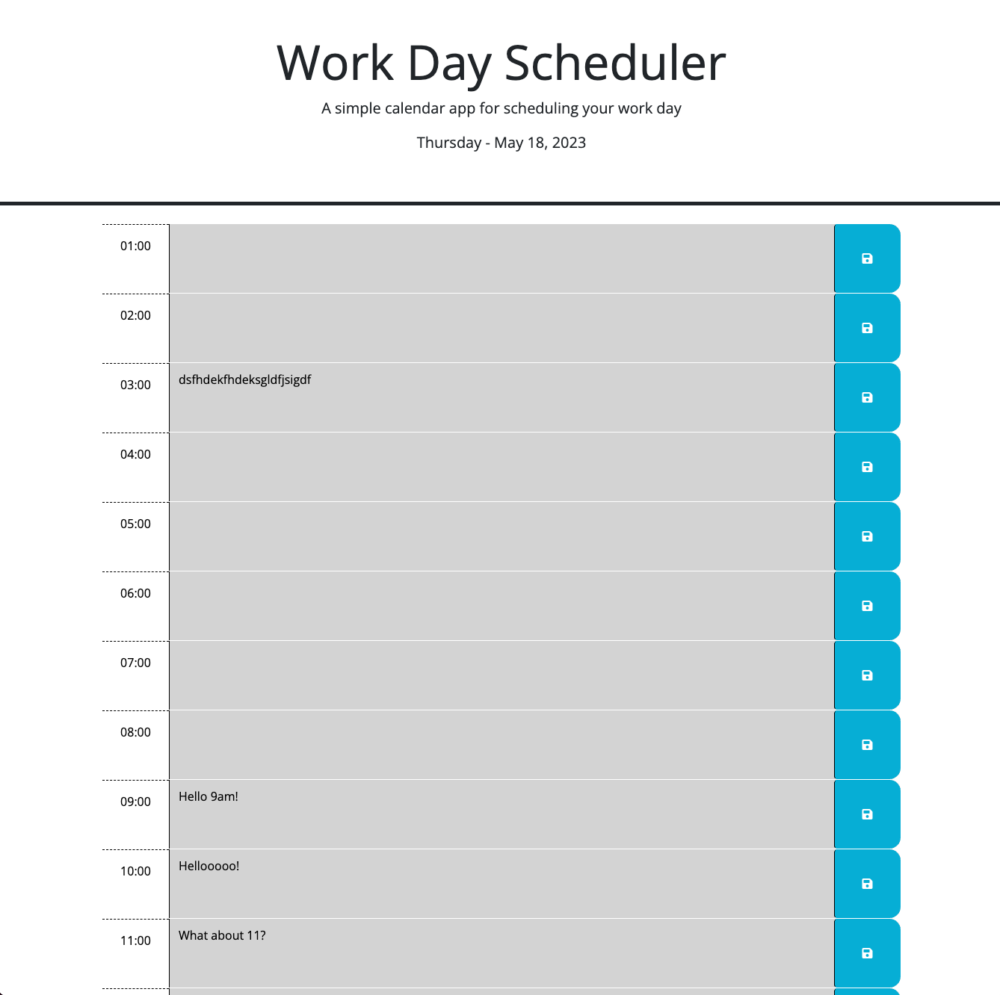

# Calendar App

## Description

This app is a simple calendar app that displays a 24 hour time block. Each time block has the ability to save tasks as text entries for your day. Past time blocks are displayed in grey, the current time block is displayed in red, and all future time blocks are green in color.

## Technologies Used

HTML  
CSS  
JavaScript  
Day.js

## Installation

There is no installation necessary, the app may be accessed via this link - https://casignacio.github.io/calendar-app-01/

## Usage

To store daily tasks, just click on the appropriate time block you want to use, enter your text, then click the save button on your right. Entries will be saved and recalled from local storage.

